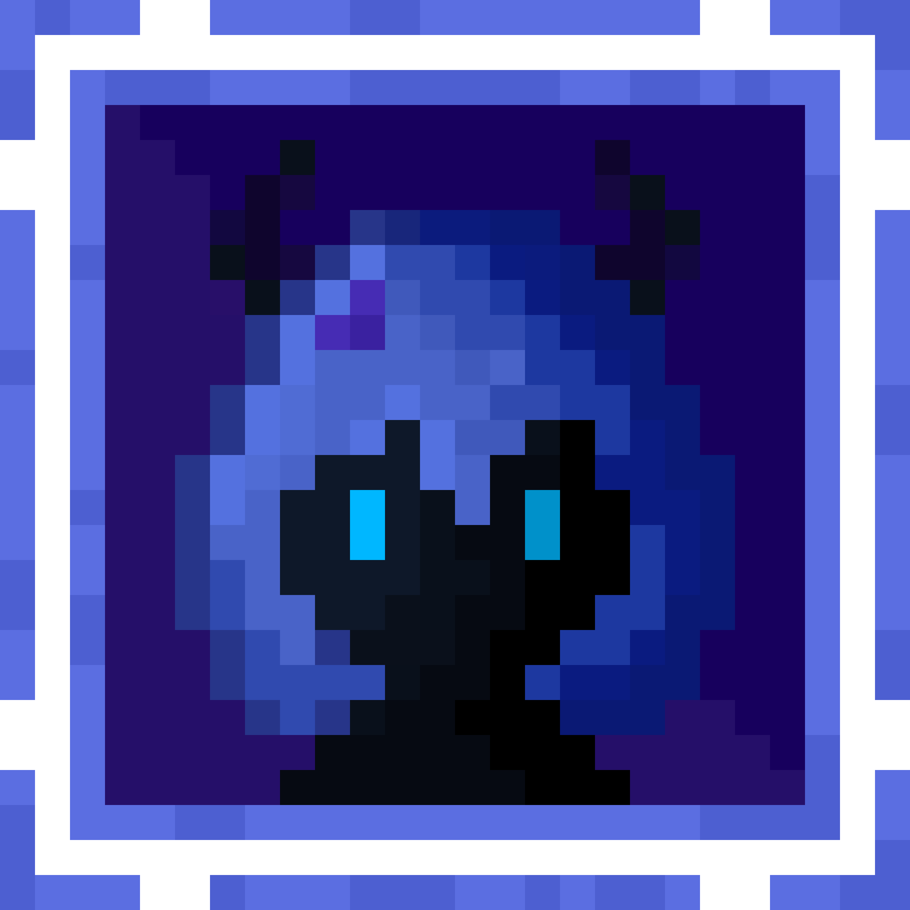

 

# `> olá, eu sou o Victor_`

**Estudante de Análise e Desenvolvimento de Sistemas na FIAP**

`[ APRENDENDO E CONSTRUINDO ]`

 

 

## `sobre mim`

Sou **Victor Sales Marques**, estudante **de ADS na FIAP**.

Aqui compartilho meus estudos, exercícios e projetos. Atualmente, estou aprofundando minha base em programação e aprendendo a organizar e documentar o que desenvolvo.

 

## `formação`

| Instituição | Curso | Situação |
| :--- | :--- | :--- |
| **FIAP** | Análise e Desenvolvimento de Sistemas | Em andamento · Primeiro semestre |
| **SENAC** | Técnico em Programação de Jogos | Concluído |

 

## `tecnologias em estudo`

  
  &nbsp;&nbsp;&nbsp;
  
  &nbsp;&nbsp;&nbsp;
  
  &nbsp;&nbsp;&nbsp;
  
  &nbsp;&nbsp;&nbsp;
  
  &nbsp;&nbsp;&nbsp;
  

  <code>Java</code> · <code>Python</code> · <code>HTML</code> · <code>CSS</code> · <code>JavaScript</code> · <code>Git</code>

 

## `estudos & projetos acadêmicos`

| Projeto | Sobre |
| :--- | :--- |
| [**Estudos em Java**](https://github.com/victor-singrax/estudos-java) | Exercícios e práticas de programação em Java. Estudo pessoal.|
| [**Exercícios FIAP**](https://github.com/victor-singrax/exercicios-fiap) | Atividades desenvolvidas ao longo da graduação. |

 

## `portfólio de jogos`

Este espaço reúne meus projetos de programação de jogos, uma área que explorei durante minha formação técnica no **SENAC**.

### Linguagem e ferramentas

- **C# — básico:** programação de scripts.
- **Unity:** desenvolvimento de jogos.
- **Blender:** modelagem 3D.
- **Aseprite:** criação de pixel art e animações 2D.
- **Unity Version Control (Plastic SCM):** controle de versão dos projetos de jogos.

  

[Consultar o repositório do portfólio →](https://github.com/victor-singrax/Portfolio-Website)

---

Um registro dos meus estudos e dos projetos que construo pelo caminho.

